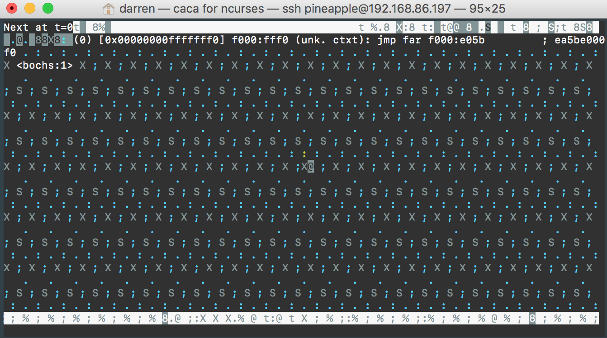

# Section 1 Notes

## 1 Introduction

This documentation was created for the operation system development tutorial [littleosbook](https://littleosbook.github.io/). Since that book was old and discontinued, we decide to write this doc to give you more newer information about how we went each steps and build the OS in **newer environment**.

Most code are referenced from the original book, the code should be running in newer system without any problem.

## 1.1 Development environment

The book recommended Ubuntu versions 11.04 and 11.10 running in virtual machine.

In our docs, we used Ubuntu 16.04 running in AWS, connected to EC2 server with [MobaXterm](https://mobaxterm.mobatek.net/). If you are Windows user, we highly recommend this method. But latter on both me and Connor ran out of AWS free tier time, we don't want to pay the bill for the server, so we used an old laptop installed [POP!OS](https://system76.com/pop) as our cloud server. If you have the same situation and luckily you have an old laptop, do this, it had a lot of fun.

::: warning
MacOS won't work well with SSH terminal, the whole terminal screen will fulfill with noises when open bochs. We will fix this this problem latter.
:::

