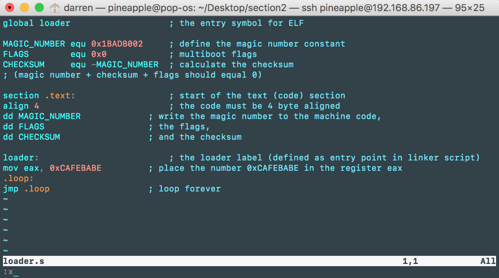
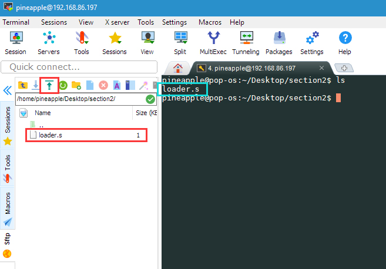
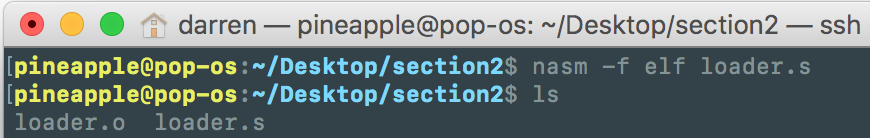
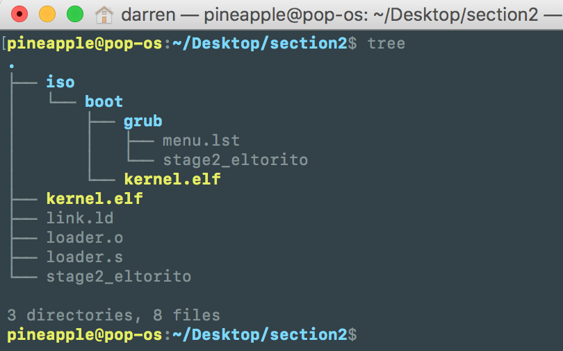
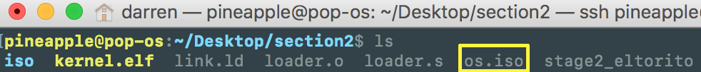

# Section 2 Notes

## 2.1 Tools
### 2.1.1 Quick Setup

We have used both Amazon Web Server(Ubuntu instance) and POP!OS as our development system. A fancy tool that we recommend for Windows user : MobaXterm.

Following the original book, run the commands below to install all the essential tools that you need:
```shell
sudo apt-get install build-essential nasm genisoimage bochs bochs-sdl
```

### 2.1.2 Programming Languages

You can use what ever you want, someone wrote the whole system using Assembly language only. In our notes, we stick with the original book, we use C.

## 2.3 Hello CAFEBABE

This is the starting point of writing code. We will write a very tiny OS that write `0xCAFEBABE` to the `eax` register.

### 2.3.1 Compiling the Operating System

Create an empty folder in your working directory. In here we called `section2`. Then change the working directory into the folder you just created. Then create a file called `loader.s`, and inside `loader.s`, paste the code below:

```assembly
global loader                   ; the entry symbol for ELF

MAGIC_NUMBER equ 0x1BADB002     ; define the magic number constant
FLAGS        equ 0x0            ; multiboot flags
CHECKSUM     equ -MAGIC_NUMBER  ; calculate the checksum
; (magic number + checksum + flags should equal 0)

section .text:                  ; start of the text (code) section
align 4                         ; the code must be 4 byte aligned
dd MAGIC_NUMBER             ; write the magic number to the machine code,
dd FLAGS                    ; the flags,
dd CHECKSUM                 ; and the checksum

loader:                         ; the loader label (defined as entry point in linker script)
mov eax, 0xCAFEBABE         ; place the number 0xCAFEBABE in the register eax
.loop:
jmp .loop                   ; loop forever
```

The code above will write a very specific number `0xCAFEBABE` to the register `eax`. 

::: tip
If you are comfortable using vim, you can create the file by `vim loader.s`. Then press `i` on your keyboard to type code. You will see the line of words `-- INSERT --` at the bottom. You can start type or paste the code from above. After you finished, press `Esc` on your keyboard, hold `Shift` then press `colon`, the cursor moved to the botton, then type `x` and press `Enter` to save your work.
:::



::: tip
Or you can use any text editor you like on your local machine, after you finished editing your code, upload your `loader.s` file to the server via MobaXterm.
:::



Like .c file, you cannot run it directly, you have to compile this file. In terminal, type command:

```shell
nasm -f elf loader.s
```

Then refresh your folder or type `ls` in your terminal, you will see the new created binary file called `loader.o`.



### 2.3.2 Linking the kernel

In the same folder, create a new file called `link.ld`. Then paste code below:

```assembly
ENTRY(loader)                /* the name of the entry label */

SECTIONS {
    . = 0x00100000;          /* the code should be loaded at 1 MB */

    .text ALIGN (0x1000) :   /* align at 4 KB */
    {
        *(.text)             /* all text sections from all files */
    }

    .rodata ALIGN (0x1000) : /* align at 4 KB */
    {
        *(.rodata*)          /* all read-only data sections from all files */
    }

    .data ALIGN (0x1000) :   /* align at 4 KB */
    {
        *(.data)             /* all data sections from all files */
    }

    .bss ALIGN (0x1000) :    /* align at 4 KB */
    {
        *(COMMON)            /* all COMMON sections from all files */
        *(.bss)              /* all bss sections from all files */
    }
}
```

Type following command to combine `loader.o` and `link.ld` into a file called `kernel.elf`:

```shell
ld -T link.ld -melf_i386 loader.o -o kernel.elf
```

### 2.3.3 Obtaining GRUB

We don't know what is the secret inside the file `stage2_eltorito`, but it is an important lootloader used in the book. Download it by command:

```shell
wget "http://littleosbook.github.com/files/stage2_eltorito"
```

Or you can download from your browser then upload to server.

### 2.3.4 Building an ISO Image

In order to run our system, we need make an ISO image so that `bochs` can load it. The kernel ISO image will be created by `genisoimage`.

First, run following commands:

```shell
mkdir -p iso/boot/grub				# create the folder structure
cp stage2_eltorito iso/boot/grub/	# copy the bootloader
cp kernel.elf iso/boot/				# copy the kernel
```

Then create a file called `menu.lst` inside your `iso/boot/grub/` folder. `menu.lst` is the configuration file for GRUB. Inside `menu.lst`, add following config scripts:

```
default=0
timeout=0

title os
kernel /boot/kernel.elf
```

Double check the file tree shown below:

```
    iso
    |-- boot
      |-- grub
      | |-- menu.lst
      | |-- stage2_eltorito
      |-- kernel.elf
```

Make sure you placed your files in right place. I know it looks weird, but you will get familiar with this. :wink:

::: tip
You can type command `tree` to display the file tree as picture shown below.
:::


Then run the following crazy long command :scream: :

```shell
genisoimage -R                              \
            -b boot/grub/stage2_eltorito    \
            -no-emul-boot                   \
            -boot-load-size 4               \
            -A os                           \
            -input-charset utf8             \
            -quiet                          \
            -boot-info-table                \
            -o os.iso                       \
            iso
```

::: tip
You can write the command above in one line without the backslash `\`.
:::

If everything goes right, you will see a file called `os.iso` has been created in your current working directory.



### 2.3.5 Running Bochs

Now it's time to run your operating system in `Bochs`!

`Bochs` is a kind virtual machine that can load the OS, with many debug features. We need a configuration file before we run `Bochs`. Lets create a config file called `bochsrc.txt`, then paste the simple configuration file below:

```
megs:            32
display_library: sdl
romimage:        file=/usr/share/bochs/BIOS-bochs-latest
vgaromimage:     file=/usr/share/bochs/VGABIOS-lgpl-latest
ata0-master:     type=cdrom, path=os.iso, status=inserted
boot:            cdrom
log:             bochslog.txt
clock:           sync=realtime, time0=local
cpu:             count=1, ips=1000000
```

If you want to use the GUI debugger, you can change `display_library: sdl` to `display_library: sdl, options="gui_debug"`. 

Save your `bochsrc.txt` and then run the command:

```shell
bochs -f bochsrc.txt -q
```

The `Bochs` will start and running, as the screenshot shown below:


Type `c` or `continue` in the `Bochs` console, you should see the `Bochs` starting and displaying a console with some information from GRUB on it.

Click the quit button of the `Bochs` at the upper right corner to quit `Bochs`.

::: tip
You can press `Ctrl+C` to exit the current console, then type `quit` to exit `Bochs`.
:::

After quit, you can open the `bochslog.txt` file, or type `cat bochslog.txt` in terminal, you will find the line with `RAX=00000000CAFEBABE` or `EAX=CAFEBABE` (depending on if you are running Bochs with or without 64 bit support) at the bottom.

 At this point, you made the first step of you OS development journey! :tada: