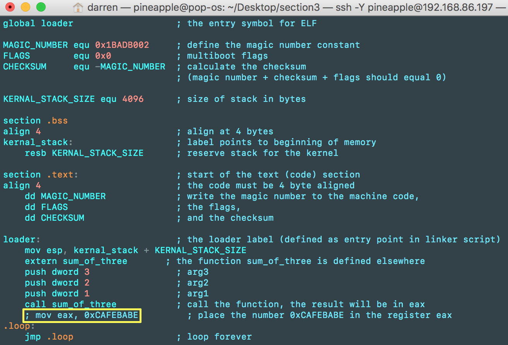
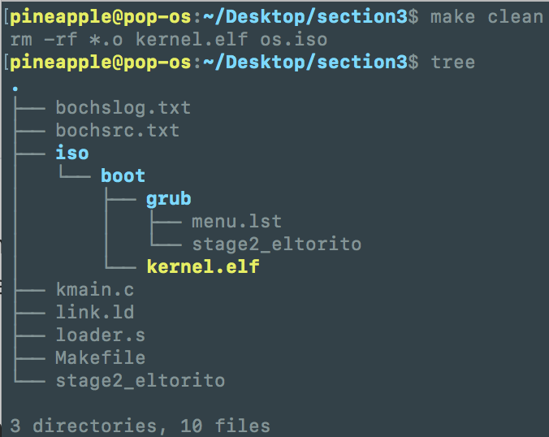
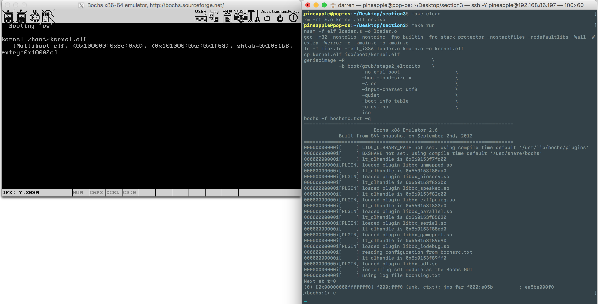
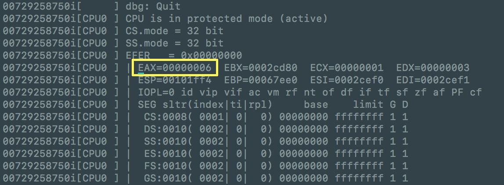

# Section 3 Notes

In this section, we will use C to write some code, it is much more programmer friendly than assembly. But before we dive into C programming, we still need to write some assembly code in order to load our C program.

::: tip
There is a typo in the original book, the assembly code `external sum_of_three` inside `loader.s` should be `extern sum_of_three`. 
:::

## 3.1 Setting Up a Stack 

A prerequisite for using C is a stack. To setup a stack, add the chunk of code below into `loader.s`:

```assembly
...
KERNEL_STACK_SIZE equ 4096                  ; size of stack in bytes

section .bss
align 4                                     ; align at 4 bytes
kernel_stack:                               ; label points to beginning of memory
resb KERNEL_STACK_SIZE                  ; reserve stack for the kernel
...
```

Then set up the stack pointer by adding `esp` to the end of the `kernel_stack` memory:

```assembly
...
loader:
	; point esp to the start of the stack (end of memory area)
	mov esp, kernel_stack + KERNEL_STACK_SIZE
...
```

## 3.2 Calling C Code From Assembly

Now lets write a very simple C code, much simpler than hello world:

```c
/* In your C program file */
int sum_of_three(int arg1, int arg2, int arg3) {
    return arg1 + arg2 + arg3;
}
```

And save the code above into a file called `kmain.c`. You can name it whatever you want, it won't affect your system.

Back to `loader.s`, inside `loader` label, after the line of code `mov esp, kernel_stack + KERNEL_STACK_SIZE`, add the code below:

```assembly
...
	loader:
        mov esp, kernel_stack + KERNEL_STACK_SIZE
        ; the function sum_of_three is defined in kmain.c
        extern sum_of_three
        push dword 3            ; arg3
        push dword 2            ; arg2
        push dword 1            ; arg1
        ; call the function, the result will be in eax
        call sum_of_three
...
```

The code above will call the function `sum_of_three`, where it has been defined in `kmain.c`, then send 3 numbers to the function. Here the 3 numbers are `1`, `2`, `3`. Since the function is addition, we should expect to see the result `6` in the `EAX` register. If you don't know why its `6`, take out your calculator and compute `1+2+3` and you will get the same result as ours. :rofl:

If you got lost, here is the code inside `loader.s`:

```assembly
global loader                   ; the entry symbol for ELF

MAGIC_NUMBER equ 0x1BADB002     ; define the magic number constant
FLAGS        equ 0x0            ; multiboot flags
CHECKSUM     equ -MAGIC_NUMBER  ; calculate the checksum
                                ; (magic number + checksum + flags should equal 0)

KERNAL_STACK_SIZE equ 4096      ; size of stack in bytes

section .bss
align 4                         ; align at 4 bytes
kernal_stack:                   ; label points to beginning of memory
    resb KERNAL_STACK_SIZE      ; reserve stack for the kernel

section .text:                  ; start of the text (code) section
align 4                         ; the code must be 4 byte aligned
    dd MAGIC_NUMBER             ; write the magic number to the machine code,
    dd FLAGS                    ; the flags,
    dd CHECKSUM                 ; and the checksum

loader:                         ; the loader label (defined as entry point in linker script)
    mov esp, kernal_stack + KERNAL_STACK_SIZE
    extern sum_of_three       ; the function sum_of_three is defined elsewhere
    push dword 3                ; arg3
    push dword 2                ; arg2
    push dword 1                ; arg1
    call sum_of_three           ; call the function, the result will be in eax
    ; mov eax, 0xCAFEBABE         ; place the number 0xCAFEBABE in the register eax
.loop:
    jmp .loop                   ; loop forever

```

::: tip
Remember to remove or comment out the `mov eax, 0xCAFEBABE`, otherwise you won't get the expected result.
:::



## 3.3 Compiling the code

Recall what we did before, we run commands to compile the `loader.s`, then combine `link.ld` and `loader.o` into a file called `kernel.elf`. And we ran the crazy long command to build an ISO image, then finally load it into `Bochs`. Since now we have the C code, we will need `gcc` to compile and combine our C code with assembly code, there will be more commands you need to type into your little terminal. That's a lot of typing work. :sob:

That's is why we need a handy tool called `make`. In your root directory, create a file called `Makefile`. Then paste the script below:

```makefile
OBJECTS = loader.o kmain.o
CC = gcc
CFLAGS = -m32 -nostdlib -nostdinc -fno-builtin -fno-stack-protector \
            -nostartfiles -nodefaultlibs -Wall -Wextra -Werror -c
LDFLAGS = -T link.ld -melf_i386
AS = nasm
ASFLAGS = -f elf

all: kernel.elf

kernel.elf: $(OBJECTS)
	ld $(LDFLAGS) $(OBJECTS) -o kernel.elf

os.iso: kernel.elf
	cp kernel.elf iso/boot/kernel.elf
	genisoimage -R                              \
				-b boot/grub/stage2_eltorito    \
                -no-emul-boot                   \
                -boot-load-size 4               \
                -A os                           \
                -input-charset utf8             \
                -quiet                          \
                -boot-info-table                \
                -o os.iso                       \
                iso

run: os.iso
	bochs -f bochsrc.txt -q

%.o: %.c
	$(CC) $(CFLAGS)  $< -o $@

%.o: %.s
	$(AS) $(ASFLAGS) $< -o $@

clean:
	rm -rf *.o kernel.elf os.iso

```

::: tip
The indentation is very important in the `Makefile`. A **tab** must come at the beginning of every line in the recipe to distinguish recipes from other lines in the `Makefile`. Check out this [official tutorial](https://www.gnu.org/software/make/manual/html_node/Simple-Makefile.html#Simple-Makefile) for more details.
:::

Save the `Makefile`, make sure the `Makefile` has been placed in the right place(root directory). You can type `make clean` in your terminal to see whether the `make` has been installed or the `Makefile` has been written correctly.

After run `make clean` successfully, since `make clean` will remove all the `.o` files, `kernel.elf` and `os.iso`, now the working directory(root directory) should looks like below:



## 3.4 Compile and Run

Finally, run the command `make run`, the `make` will compile the kernel and boot it up in `Bochs`.



After quit `Bochs`, check the `bochslog.txt`, the expected result should be right here:



That's all for the section 3! :tada: