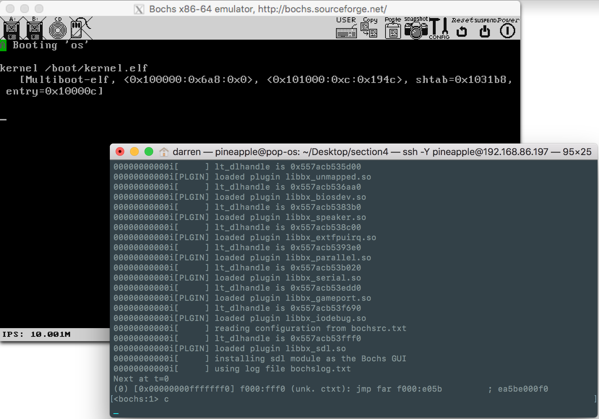
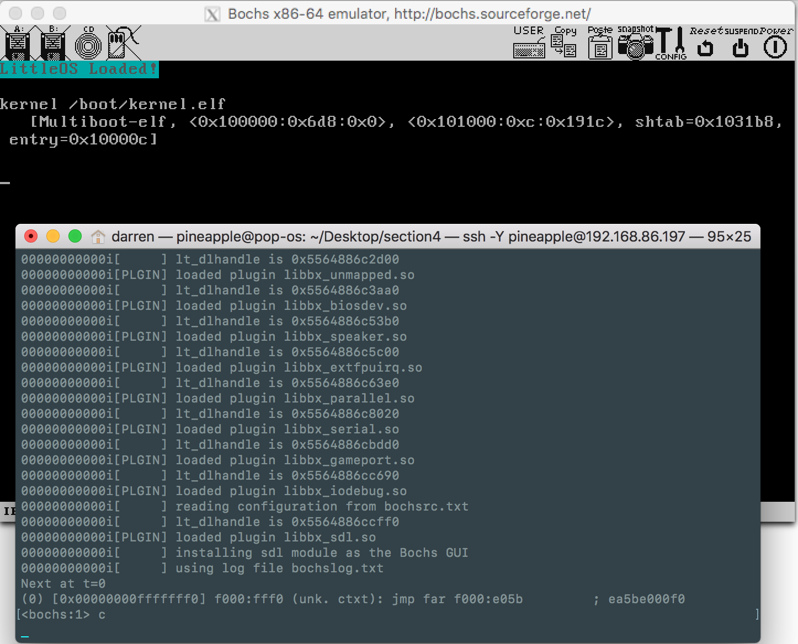

# Section 4 Notes

This section focused on output, how to display text on the console, and how to writing data to the file (in the original book it called [serial port](https://littleosbook.github.io/#output)). In order to do this, we need to create two drivers: A driver for framebuffer and a driver for serial port. We will have separate folder to save the header files, which is a better way to manage the code.

## 4.1 Header files folder

You do can write all your code inside `kmain.c`. But it is a good idea to separate the code into small pieces. If you don't want to do this, you can skip this part.

Create a new folder called `headers` in your root directory, you will save all your header files into this folder latter. Then add the `-I$(HEADERS)` to your `Makefile` to link all the header files. The updated `Makefile` is below:

```makefile
OBJECTS = loader.o kmain.o framebuffer.o io.o serialport.o
CC = gcc

CFLAGS = -m32 -nostdlib -nostdinc -fno-builtin -fno-stack-protector \
             -nostartfiles -nodefaultlibs -Wall -Wextra -Werror -c -I$(HEADERS)
LDFLAGS = -T link.ld -melf_i386
AS = nasm
ASFLAGS = -f elf
HEADERS = headers

all: kernel.elf

kernel.elf: $(OBJECTS)
	@ld $(LDFLAGS) $(OBJECTS) -o kernel.elf

os.iso: kernel.elf
	@cp kernel.elf iso/boot/kernel.elf
	@genisoimage -R                              \
                 -b boot/grub/stage2_eltorito    \
                 -no-emul-boot                   \
                 -boot-load-size 4               \
                 -A os                           \
                 -input-charset utf8             \
                 -quiet                          \
                 -boot-info-table                \
                 -o os.iso                       \
                 iso

run: os.iso
	bochs -f bochsrc.txt -q

%.o: %.c
	$(CC) $(CFLAGS)  $< -o $@

%.o: %.s
	@$(AS) $(ASFLAGS) $< -o $@

clean:
	rm -rf *.o kernel.elf os.iso
```

::: tip
The `@` before each command means ignore the output to the screen. You can add or remove it depends on your favor.
:::

## 4.2 The Framebuffer

This part will create a driver for framebuffer, it will display a character or a sentence to the console.

### 4.2.1 Writing Text and controlling the cursor

Create a file called `framebuffer.c`.

::: tip
You should figured out what files we need from the `Makefile` above. :satisfied:
:::

The `framebuffer` made two things, display a character into the console, and display a line of words (or a sentence) into the console. Below is the code we wrote:

```c
#include "framebuffer.h"

/** fb_write_cell:
 *  Writes a character with the given foreground and background to position i
 *  in the framebuffer.
 *
 *  @param i  The location in the framebuffer
 *  @param c  The character
 *  @param fg The foreground color
 *  @param bg The background color
 */
void fb_write_cell(unsigned int i, char c, unsigned char fg, unsigned char bg)
{
    char *fb = (char *) 0x000B8000;
    fb[i] = c;
    fb[i + 1] = ((fg & 0x0F) << 4) | (bg & 0x0F);
}

/** fb_write_string:
 *  Writes a sentence with the given foreground and background to position i
 *  in the framebuffer.
 *
 *  @param i  The location in the framebuffer
 *  @param s  The string
 *  @param fg The foreground color
 *  @param bg The background color
 */
void fb_write_string(unsigned int i, char s[], unsigned char fg, unsigned char bg)
{
	char key = s[i];
	if (key != 0) {
		char *fb = (char *) 0x000B8000;
		fb[i * 2] = key;
		fb[i * 2 + 1] = ((fg & 0x0F) << 4) | (bg & 0x0F);
		i++;
		fb_write_string(i, s, fg, bg);
	}
}

/** fb_move_cursor:
 *  Moves the cursor of the framebuffer to the given position
 *  @param pos The new position of the cursor
 */
void fb_move_cursor(unsigned short pos)
{
    outb(FB_COMMAND_PORT, FB_HIGH_BYTE_COMMAND);
    outb(FB_DATA_PORT,    ((pos >> 8) & 0x00FF));
    outb(FB_COMMAND_PORT, FB_LOW_BYTE_COMMAND);
    outb(FB_DATA_PORT,    pos & 0x00FF);
}

/** fb_write_cursor:
 *  Writes a sentence of length followed by the cursor
 * 
 *  @param buf         The array of characters
 *  @param len         The length of the array
 *  @param cursorStart The starting position of the cursor
 *  @return            The end position of the cursor
 */
unsigned int fb_write_cursor(char *buf, unsigned int len, unsigned int cursorStart) {
  unsigned int cursorPos = cursorStart;
  unsigned int i = 0;
  fb_move_cursor(cursorPos);
  for ( ; i < len; i++) {
    if (!buf[i]) {
      break;
    }
    fb_write_cell((cursorPos)*2, buf[i], BG_CYAN, FB_DARK_GREY);
    fb_move_cursor(cursorPos);
    cursorPos++;
  }
  fb_move_cursor(cursorPos);
  return cursorPos;
}
```

::: tip
`fb_write_string` is the function we have tried to display a sentence based on `fb_write_cell` function. But you have to be careful to compute the position.
:::

Inside the `headers` folder, create the first header file `framebuffer.h`, and paste code below:

```c
#include "io.h"

/* The I/O ports */
#define FB_COMMAND_PORT         0x3D4
#define FB_DATA_PORT            0x3D5

/* The I/O port commands */
#define FB_HIGH_BYTE_COMMAND    14
#define FB_LOW_BYTE_COMMAND     15

/* Colors */
#define BG_GREEN 2
#define FB_GREEN 2
#define FB_DARK_GREY 8
#define BG_CYAN 3

void fb_write_cell(unsigned int i, char c, unsigned char fg, unsigned char bg);
void fb_write_string(unsigned int i, char s[], unsigned char fg, unsigned char bg);
unsigned int fb_write_cursor(char *buf, unsigned int len, unsigned int cursorStart);
```

::: tip
You can find the magic number of the color in [from original book](https://littleosbook.github.io/#writing-text).
:::


It's not easy to move the blinking cursor. We need create a new assembly file `io.s` in the `root` directory with the "outbound" function:

```assembly
global outb             ; make the label outb visible outside this file

; outb - send a byte to an I/O port
; stack: [esp + 8] the data byte
;        [esp + 4] the I/O port
;        [esp    ] return address
outb:
    mov al, [esp + 8]    ; move the data to be sent into the al register
    mov dx, [esp + 4]    ; move the address of the I/O port into the dx register
    out dx, al           ; send the data to the I/O port
    ret
```

We also need to connect this assembly code with C code, so that we can control the cursor through C code instead of assembly. Creating a header `io.h` in the `headers` folder, then paste code:

```c
#ifndef INCLUDE_IO_H
#define INCLUDE_IO_H

/** outb:
     *  Sends the given data to the given I/O port. Defined in io.s
     *
     *  @param port The I/O port to send the data to
     *  @param data The data to send to the I/O port
     */
void outb(unsigned short port, unsigned char data);

#endif /* INCLUDE_IO_H */
```

Now all necessary code are done. Back to `kmain.c`, try some code below:

```c
/* IO */
#include "framebuffer.h"

int main() {
    // fb_write_cell(0, 'A', FB_GREEN, FB_DARK_GREY);
    char str[] = "LittleOS Loaded!";
    // fb_write_string(0, str, BG_CYAN, FB_DARK_GREY);
    fb_write_cursor(str, 16, 0x01E0);
    return 0;
}
```

And remember to change the `loader.s` file:

```assembly
global loader

MAGIC_NUMBER equ 0x1BADB002
FLAGS equ 0x0
CHECKSUM equ -MAGIC_NUMBER
KERNAL_STACK_SIZE equ 4096

extern main

section .bss
align 4
kernal_stack:
    resb KERNAL_STACK_SIZE

section .text
align 4
    dd MAGIC_NUMBER
    dd FLAGS
    dd CHECKSUM

loader:
    mov esp, kernal_stack + KERNAL_STACK_SIZE
    call main
    mov eax, 0xCAFEBABE
.loop:
    jmp .loop
```

We should call `main` instead of `sum_of_three`.

Finally run your `Bochs`, see what happened, you should see some similar result as ours:






::: tip
If you got the error said `make: *** No rule to make target 'serialport.o', needed by 'kernel.elf'.  Stop. ` , you can remove the `serialport.o` in the `Makefile` since we did not write it yet. You will need to add it latter.
:::


## 4.3 The Serial Ports

This part is a little bit hard to understand, but you can think about serial port as an interface for you to input and output. For example, you can input some text from your code and then write into a file.

We need to add few lines of assembly code to handle the input port, add the code inside `io.s`:

```assembly
global outb             ; make the label outb visible outside this file
...

global inb

; inb - returns a byte from the given I/O port
; stack: [esp + 4] The address of the I/O port
;        [esp    ] The return address
inb:
    mov dx, [esp + 4]       ; move the address of the I/O port to the dx register
    in  al, dx              ; read a byte from the I/O port and store it in the al register
    ret                     ; return the read byte
```


In `headers/io.h` file, adding the defined ports, and connecting the "inbound" assembly code :

```c
/* The I/O ports */

/* All the I/O ports are calculated relative to the data port. This is because
     * all serial ports (COM1, COM2, COM3, COM4) have their ports in the same
     * order, but they start at different values.
     */

#define SERIAL_COM1_BASE                0x3F8      /* COM1 base port */

#define SERIAL_DATA_PORT(base)          (base)
#define SERIAL_FIFO_COMMAND_PORT(base)  (base + 2)
#define SERIAL_LINE_COMMAND_PORT(base)  (base + 3)
#define SERIAL_MODEM_COMMAND_PORT(base) (base + 4)
#define SERIAL_LINE_STATUS_PORT(base)   (base + 5)

/* SERIAL_LINE_ENABLE_DLAB:
     * Tells the serial port to expect first the highest 8 bits on the data port,
     * then the lowest 8 bits will follow
     */
#define SERIAL_LINE_ENABLE_DLAB         0x80

#ifndef INCLUDE_IO_H
#define INCLUDE_IO_H

/** outb:
 *  Sends the given data to the given I/O port. Defined in io.s
 *
 *  @param port The I/O port to send the data to
 *  @param data The data to send to the I/O port
 */
void outb(unsigned short port, unsigned char data);

#endif /* INCLUDE_IO_H */

/** inb:
 *  Read a byte from an I/O port.
 *
 *  @param  port The address of the I/O port
 *  @return      The read byte
 */
unsigned char inb(unsigned short port);
```


Then create `serialport.c` in the `root` directory, paste the defined function below:

```c
#include "io.h"

/* The I/O port commands */

/** serial_configure_baud_rate:
 *  Sets the speed of the data being sent. The default speed of a serial
 *  port is 115200 bits/s. The argument is a divisor of that number, hence
 *  the resulting speed becomes (115200 / divisor) bits/s.
 *
 *  @param com      The COM port to configure
 *  @param divisor  The divisor
 */
void serial_configure_baud_rate(unsigned short com, unsigned short divisor)
{
    outb(SERIAL_LINE_COMMAND_PORT(com),
            SERIAL_LINE_ENABLE_DLAB);
    outb(SERIAL_DATA_PORT(com),
            (divisor >> 8) & 0x00FF);
    outb(SERIAL_DATA_PORT(com),
            divisor & 0x00FF);
}

/** serial_configure_line:
 *  Configures the line of the given serial port. The port is set to have a
 *  data length of 8 bits, no parity bits, one stop bit and break control
 *  disabled.
 *
 *  @param com  The serial port to configure
 */
void serial_configure_line(unsigned short com)
{
    /* Bit:     | 7 | 6 | 5 4 3 | 2 | 1 0 |
        * Content: | d | b | prty  | s | dl  |
        * Value:   | 0 | 0 | 0 0 0 | 0 | 1 1 | = 0x03
        */
    outb(SERIAL_LINE_COMMAND_PORT(com), 0x03);
}

/** serial_configure_buffers
*   Configure the FIFOs of the given serial port. The port is set to have a
*   FIFO enabled, both transmission and reciever queues cleared, with 
*   14 byte FIFOs
*/
void serial_configure_buffers(unsigned int com)
{
	/* Bit:     | 7 6 | 5  | 4 | 3   | 2   | 1   | 0 |
	* Content:	| lvl | bs | r | dma | clt | clr | e |
	* Value:	| 1 1 | 0  | 0 |  0  |  1  |  1  | 1 | = 0xC7
	*/
	outb(SERIAL_FIFO_COMMAND_PORT(com), 0xC7);
}

/** serial_configure_modem
*   Configure the Modem of the given serial port. The port is set to have a 
*   Modem with no interrupts enabled
*/
void serial_configure_modem(unsigned int com)
{
	/* Bit:     | 7 | 6 | 5  | 4  | 3   | 2   | 1   | 0   |
	* Content:  | r | r | af | lb | ao2 | ao1 | rts | dtr |
	* Value:    | 0 | 0 | 0  | 0  |  0  |  0  |  1  |  1  | = 0x03
	*/
	outb(SERIAL_MODEM_COMMAND_PORT(com), 0x03);
}


/** serial_is_transmit_fifo_empty:
 *  Checks whether the transmit FIFO queue is empty or not for the given COM
 *  port.
 *
 *  @param  com The COM port
 *  @return 0 if the transmit FIFO queue is not empty
 *          1 if the transmit FIFO queue is empty
 */
int serial_is_transmit_fifo_empty(unsigned int com)
{
    /* 0x20 = 0010 0000 */
    return inb(SERIAL_LINE_STATUS_PORT(com)) & 0x20;
}

void serial_set_up()
{
	serial_configure_baud_rate(SERIAL_COM1_BASE, 1);
	serial_configure_line(SERIAL_COM1_BASE);
	serial_configure_buffers(SERIAL_COM1_BASE);
	serial_configure_modem(SERIAL_COM1_BASE);
}

void serial_write(char * buf, int len)
{
	int burst_length = (len < 14) ? len : 14;
	int i = 0;

	while (burst_length)
	{
		while (!serial_is_transmit_fifo_empty(SERIAL_COM1_BASE)) {};

		for (i = 0; i < burst_length; ++i)
		{
			outb(SERIAL_DATA_PORT(SERIAL_COM1_BASE), *(buf + i));
		}

		buf += burst_length;
		len -= burst_length;

		burst_length = (len < 14) ? len : 14;
	}
}
```

We actually only need two of the functions above, write the header file `serialport.h` in `headers` folder:

```c
#ifndef INCLUDE_SERIAL_H
#define INCLUDE_SERIAL_H
void serial_set_up();
void serial_write(char * buf, int len);
#endif
```


Before we run the `make`, we need to change the configuration file of `Bochs` by adding:

```
...
com1: enabled=1, mode=file, dev=com1.out
```

 This will save the output from the first serial port into a file called `com1.out`.


Then back to `kmain.c`:

```c
/* IO */
#include "serialport.h"
int main() {
    char portMsg[] = "port message!";
    serial_set_up();
    serial_write(portMsg, 14);
    return 0;
}
```


Finally run the `Bochs`, there will be a file called `com1.out` file generated in the `root` directory. Type command `cat com1.out` in the terminal, the string `port message!` where defined in the `kmain.c` will displayed on the terminal! :tada:

